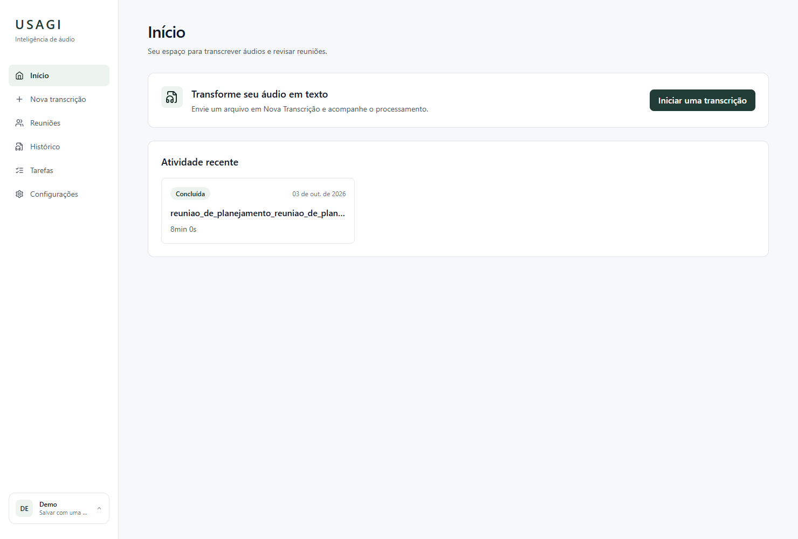
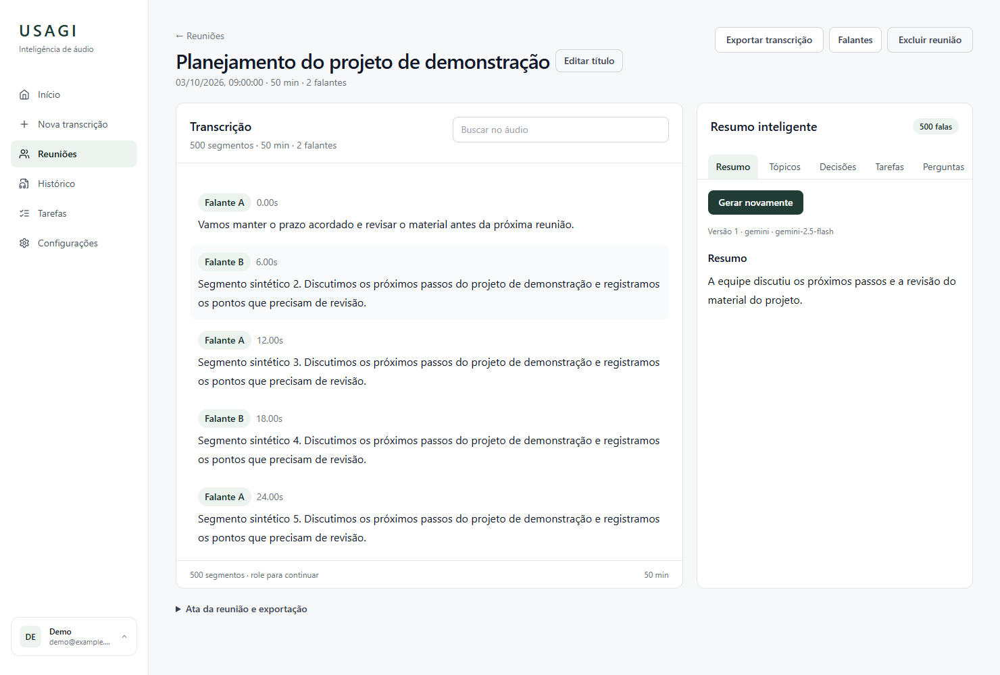
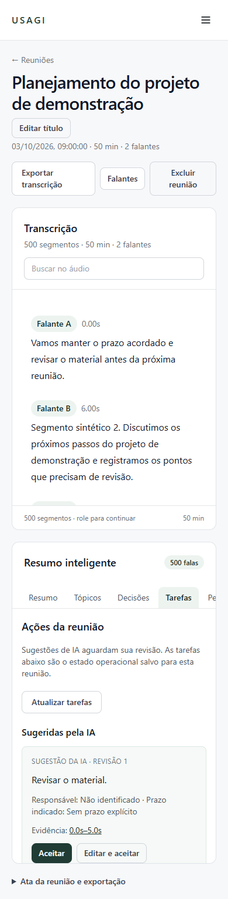
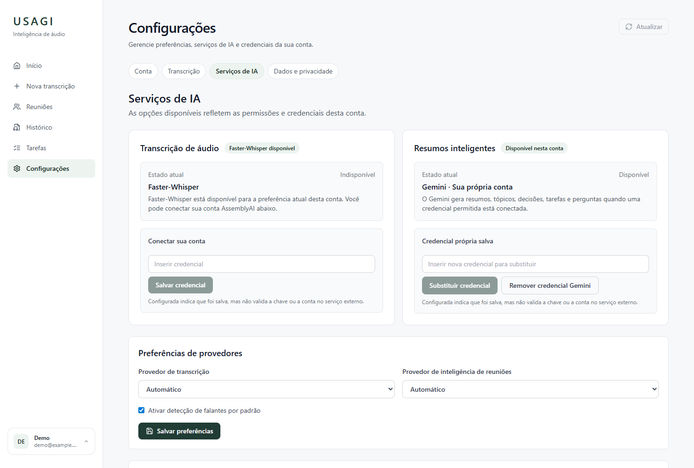
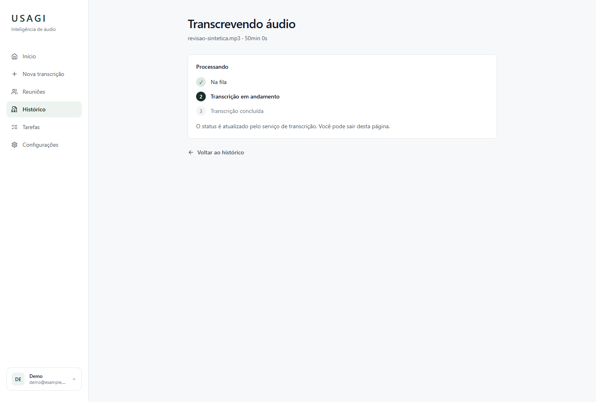

# P5-01 — Product UI/UX & Design System

## Referência e implementação

As imagens `00.png` a `08.png` são as referências visuais aprovadas. Todas foram
inspecionadas antes da implementação; o conector Figma não foi utilizado.
Os exemplos das referências orientam comportamento e hierarquia, não dados do produto.

| Referência | Tela/comportamento implementado |
| --- | --- |
| 00 | Direção visual e tokens compartilhados |
| 01 | Nova transcrição, upload e atividade recente |
| 02 | Processamento e acompanhamento do job |
| 03 | Workspace, transcrição e evidências |
| 04 | Tarefas revisadas |
| 05 | Reuniões e histórico |
| 06 | Configurações e serviços de IA/BYOK |
| 07 | Autenticação integrada à navegação da aplicação |
| 08 | Estados de credencial e comportamento responsivo |

O frontend usa os contratos existentes de P3/P4, sem novos endpoints, migrations,
providers ou conteúdo fictício. A seção Tarefas reutiliza as tarefas revisadas
da reunião selecionada. Os detalhes antigos de transcrição e atas continuam acessíveis.

## Fundação visual

- Tokens de superfície, borda, texto, raio e verde escuro USAGI em `src/styles/index.css`
  e `tailwind.config.js`; componentes existentes reutilizados.
- `PageHeader`, `StatusBadge`, `ProcessingStatus` e formatadores de data/duração.
- Sidebar consistente, área da conta, navegação móvel, foco visível, skip link,
  estados de loading/error/disabled e preferência de movimento reduzido.
- Workspace com panes limitados e rolagem independente, texto longo quebrável,
  busca e navegação até evidências; empilhamento em telas menores.

## Diferenças intencionais

- Exportação não é formato do áudio. São oferecidos somente os formatos existentes
  ou efetivamente implementados: TXT, SRT, VTT, JSON e as exportações de atas existentes;
  não se promete PDF.
- Sem estimativa inventada de duração nem progresso fictício de inferência. Upload
  mostra progresso de envio; processamento mostra os estados reais do job.
- Tarefas são consultadas por reunião, não como agregação global inexistente na API.
  A busca de Histórico se limita à página carregada; paginação e filtro de status
  continuam no servidor.
- Credencial BYOK salva não significa credencial homologada pelo provider. Preferências,
  disponibilidade e origem de credencial refletem a política real do backend.
  Nenhum secret é devolvido pela UI; inputs são limpos após operações e troca de aba.
- Autenticação mantém usuário/senha e Guest existentes, sem Google Login/Firebase.
  Configuração de perfil local não é apresentada como alteração persistida no servidor.
- Transcrição não ganhou edição de texto inexistente no contrato; título e falantes
  preservam suas ações existentes. Exemplos de hover/edição não viraram registros.
- A pilha de fontes prefere Inter, com fallback do sistema; não foi introduzida
  dependência de download remoto de fonte.

## Comparação visual local

Screenshots em `implemented/` foram produzidas com Chromium headless e respostas
**sintéticas de teste**, sem dados pessoais ou credenciais. A comparação cobriu dez
telas/estados em desktop 1480×1000 e mobile 390×844. O workspace foi exercitado com
500 segmentos e rolagem real; não houve overflow horizontal no viewport móvel testado.
O browser integrado estava indisponível; não se afirma walkthrough manual nele.

| Home | Workspace |
| --- | --- |
|  |  |

| Mobile | Settings | Processamento |
| --- | --- | --- |
|  |  |  |

## Validação da entrega

- Frontend: 103 testes em 19 arquivos; lint sem warnings; build Vite aprovado.
- Backend: 263 testes aprovados no projeto Docker isolado `usagip4prefs`, incluindo
  integração PostgreSQL/Redis/RQ com engines simulados; 11 warnings preexistentes.
- Alembic upgrade/check, compilação Python, build Docker frontend, Compose config
  e `git diff --check` aprovados.
- Smoke navegador → API real isolada: signup/login/logout/refresh, preferências,
  upload e criação de job, polling, reunião longa, renomeação de falante, conclusão
  de tarefa, download SRT e exclusão. Conclusão do job foi preparada com resultado
  sintético no PostgreSQL: **não foi executada inferência ML nem chamada paga**.
  O limite público rejeitou tentativas excedentes; apenas contadores sintéticos do
  Redis isolado foram reinicializados para concluir o smoke, sem mudar limites.
- O smoke detectou e corrigiu o envelope incorreto no PATCH de preferências:
  o frontend agora envia os campos no formato já exigido pelo backend. Regressão
  coberta no teste do client, sem alteração da API.
- Gitleaks no histórico da Task sem leaks. Auditoria npm completa encontrou cinco
  apontamentos HIGH na cadeia **dev** Tailwind/braces/chokidar/micromatch/fast-glob,
  preexistente e sem alteração de manifests nesta Task; não realizar major upgrade
  automaticamente. JWT em storage do frontend também permanece decisão preexistente.

Não houve homologação de produção, nova homologação Gemini/AssemblyAI, promoção de
Pyannote 4 ou alteração da matriz ML. Aprovação visual humana no PR continua necessária.

## Correções após revisão da interface

Início agora é uma Home/dashboard: apresentação simples e CTA para Nova Transcrição;
contas autenticadas também veem atividade recente. O upload existe somente em
`/new-transcription`; a rota legada `/guest` redireciona para ela. Resultados Guest
pendentes e sua conversão explícita continuam acessíveis na Home, sem transferir
ownership automaticamente e sem consultar a política de upload na Home vazia.

AssemblyAI exibe **Indisponível** quando o backend não permite seu uso: contas usam
`available` e `allowed` de `/settings/providers`; Guest usa `can_create_job` de
`/guest/policy`. Seleção/envio e seletor Guest são bloqueados coerentemente.
Esses estados não atestam disponibilidade da rede ou validade externa da chave.

O formulário de tarefas usa colunas responsivas, labels empilhados e inputs
compartilhados de altura igual; texto/data nativos antes diferiam por 2 px.
O detalhe da transcrição reutiliza `max-w-6xl`, com quebra de nome longo, toolbar
flexível e grid 1/2/4 colunas. A inspeção também detectou e corrigiu overflow de
nomes longos na atividade recente da Home autenticada.

Validação desta rodada: **110 testes frontend**, lint e build aprovados. Aplicação
iniciada com Vite; Playwright/Chromium local autorizado pelo usuário depois da falha
de conexão MCP. Screenshots capturadas e inspecionadas em 1480, 1280, 900, 640 e
390 px; nenhum erro de console/JavaScript ou overflow horizontal nos cenários
testados. O grid e a transcrição têm a mesma largura; responsável/prazo têm iguais
larguras/alturas e se empilham no mobile. Backend não alterado ou re-homologado
nesta rodada; API e estados são representados por fixtures sintéticas na inspeção.

| Tela | Desktop | Mobile |
| --- | --- | --- |
| Home | [Conta](implemented/home.png) | [Guest](implemented/guest-home-mobile.png) / [Conta](implemented/home-mobile.png) |
| Nova Transcrição | [AssemblyAI indisponível](implemented/upload.png) | [Guest indisponível](implemented/upload-mobile.png) |
| Reunião | [Campos da tarefa](implemented/meeting-fields.png) | [Campos empilhados](implemented/meeting-fields-mobile.png) |
| Transcrição | [Container e grid](implemented/transcription.png) | [Nome longo sem overflow](implemented/transcription-mobile.png) |
